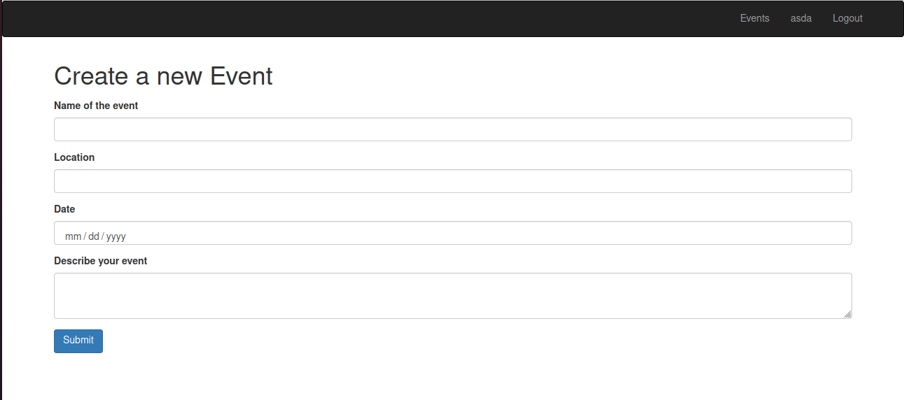

# Member's Only
In this applicaiton users could attend many events. I've created a sessions system to back up the login. This is a ruby on rails based application where we developed our own associations relationships.




# Requirements

- Ruby > 2.7
- Ruby on Rails > 5.2
- Rubocop
- Bcrypt

## Built With

- Ruby
- Ruby on Rails

### Prerequisites

Ruby: 2.7.0
Rails: 5.2

### Setup

Instal gems with:

```
bundle install
```

Setup database with:

```
   rails db:create
   rails db:migrate
```

## Author

👤 **Angel Benjamin Cussi Callisaya**

- Github: [@abcussi](https://github.com/abcussi)
- Twitter: [@thecussi](https://twitter.com/thecussi)
- Linkedin: [angel-cussi](https://www.linkedin.com/in/angel-cussi-1b2310174/)

## 🤝 Contributing

Contributions, issues and feature requests are welcome!

Feel free to check the [issues page](issues/).

## Show your support

Give a ⭐️ if you like this project!